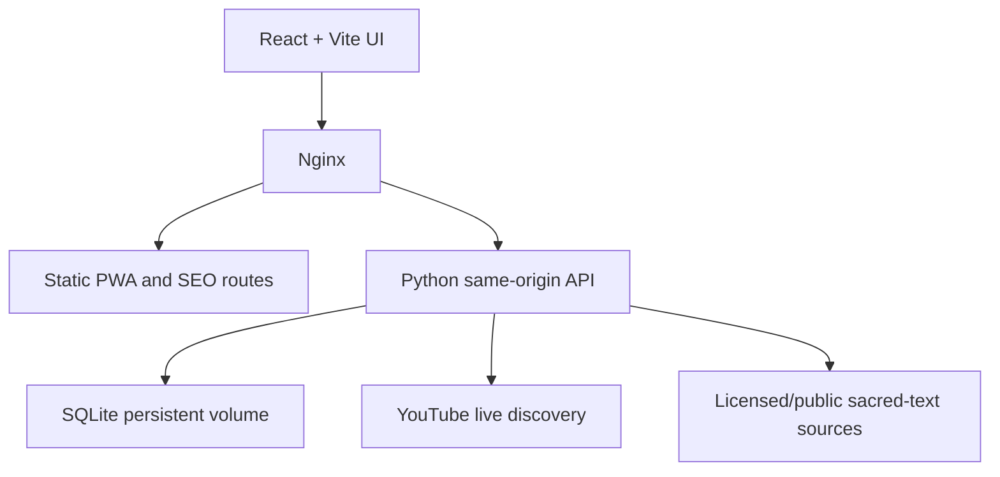

# Divinity Harmony

Divinity Harmony is a modern Hindu devotional platform for discovering mantras, reading sacred texts, watching live temple darshan, learning about deities and temples, following daily Panchang details, recording japa, and finding regional puja services.

Production: [mantra.sigq.in](https://mantra.sigq.in)

## Features

- **Sacred Mantras** — searchable mantra catalog, deity filters, ten regional writing scripts, contextual explanations, dynamic devotional YouTube playback, favorites and a 108-count digital japa mala.
- **Sacred Texts** — categorized Vedas, Upanishads, Itihasa, Puranas, Gita and devotional literature with full-content and chapter reading APIs.
- **Live Temple Darshan** — automatically discovers currently live YouTube temple/darshan streams without asking visitors for an API key.
- **Deity Encyclopedia** — deity profiles with iconography, festivals, associated mantras and related scriptures.
- **Temple Directory** — searchable temple cards, OpenStreetMap display, browser geolocation and distance sorting.
- **Priest & Puja Directory** — 12 regional searches with Google Maps, Google contact search and Justdial links.
- **Puja Vidhi Library** — materials and step-by-step preparation for common pujas, homas, ancestral rites and wedding rituals.
- **Dynamic Panchang** — date/location-driven tithi, paksha, nakshatra, yoga, karana, moon phase, sunrise and sunset with animated cards.
- **Personal Practice** — anonymous device profile, favorites and daily japa progress stored in SQLite.
- **Installable PWA** — web manifest, service worker and offline shell caching.
- **SEO-ready routes** — post-build static HTML entry points for primary public sections.
- **Mobile wrapper** — Capacitor configuration for later Android/iOS packaging.

## Application routes

| Route | Module |
| --- | --- |
| `/` | Homepage and daily Panchang |
| `/mantras` | Mantra Library and japa |
| `/scriptures` | Sacred Texts reader |
| `/darshan` | Live Temple Darshan |
| `/deities` | Deity encyclopedia |
| `/temples` | Temple map and directory |
| `/priests` | Priest discovery and Puja Vidhi |
| `/settings` | Profile and preferences |

## Architecture



The Docker container serves the built React application through Nginx. Requests under `/api/` are proxied to the Python service running inside the same container.

## Technology

- React 18, TypeScript and Vite
- Tailwind CSS and Radix UI
- React Router
- Python standard-library HTTP service
- SQLite
- Nginx
- Docker and Docker Compose

## Local development

Requirements:

- Node.js 20+
- npm
- Python 3.11+

Install dependencies:

```bash
npm ci
```

Run the API:

```bash
DH_DB_PATH=/tmp/divinity-harmony.db python3 server/live_darshan_api.py
```

Run Vite in another terminal:

```bash
npm run dev
```

Vite proxies API requests during development according to `vite.config.ts`.

## Environment variables

Copy the example configuration:

```bash
cp .env.example .env
```

| Variable | Required | Purpose |
| --- | --- | --- |
| `DH_DB_PATH` | No | SQLite database location. Docker uses `/data/divinity-harmony.db`. |
| `ANTHROPIC_API_KEY` | No | Enables enhanced server-side explanations. Never expose it as a `VITE_*` value. |
| `VITE_MANTRA_CATALOG_URL` | No | Merges a hosted, validated mantra JSON catalog with bundled content. |
| `VITE_LIVE_DARSHAN_FEED_URL` | No | Uses an alternative public Live Darshan feed. |
| `VITE_SUPPORT_URL` | No | Displays an optional external donation/support destination. |
| `VITE_SUPABASE_URL` | For accounts | Supabase project URL used by browser authentication. |
| `VITE_SUPABASE_PUBLISHABLE_KEY` | For accounts | Supabase publishable key. The legacy anon key is also accepted. |

Visitors do not need to provide an API key.

## Supabase authentication and profile photos

Login, registration, password recovery, persistent sessions, profile metadata and
avatar uploads use Supabase. Guest browsing and local preferences continue to
work when Supabase is not configured.

1. Create a Supabase project.
2. Open **SQL Editor** and run [`supabase/setup.sql`](supabase/setup.sql). This
   creates the public `avatars` bucket, limits images to 2 MB and installs
   row-level policies so authenticated users can modify only their own folder.
3. In **Authentication → URL Configuration**, set the Site URL to
   `https://mantra.sigq.in` and add
   `https://mantra.sigq.in/settings` as a redirect URL.
4. Add these deployment variables:

```env
VITE_SUPABASE_URL=https://YOUR_PROJECT.supabase.co
VITE_SUPABASE_PUBLISHABLE_KEY=YOUR_PUBLISHABLE_KEY
```

5. Rebuild the frontend. Vite variables are embedded at build time, so restarting
   an old image is not sufficient.

The publishable key is intended for browser use. Never put a Supabase
`service_role` key in this application or in any `VITE_*` variable.

## Mantra catalog

The bundled mantra data remains available when a remote catalog is unavailable. A remote catalog may contain any number of valid entries and is validated and deduplicated before display.

See:

- [Catalog setup](docs/mantra-catalog.md)
- [Example catalog](public/mantra-catalog.example.json)

Only use recordings, translations and images that are public domain, openly licensed, owned by the project, or used with permission. The interface provides graceful media fallbacks when an external file becomes unavailable.

Each mantra searches for a matching devotional recording through the same-origin
API and plays it in YouTube's privacy-enhanced official player. The app does not
download, extract or convert YouTube audio to MP3. Visitors can switch the sacred
text between Devanagari, IAST, Odia, Telugu, Tamil, Bengali, Gujarati, Punjabi,
Kannada and Malayalam; the selected script is remembered in that browser.

See the [implementation gap analysis](docs/implementation-gap-analysis.md) for
the verified status of every architecture requirement and the remaining work.

## Priest directory and Puja Vidhi

The directory does not copy unverified personal phone numbers. Each city card opens current public search results on Google Maps, Google Search or Justdial, where visitors can check ratings, phone details and availability.

Puja Vidhi articles are educational preparation guides. Exact mantras, muhurta, homa procedures, samskaras and lineage-specific ancestral rites should be confirmed with a qualified priest.

## Panchang accuracy

The Panchang widget changes by date and optional browser location. It provides a daily spiritual overview and is not intended as an ephemeris or muhurta calculation engine. Confirm exact transition times and ceremonial muhurta using a trusted regional Panchang.

## Quality checks

```bash
npm run lint
npm run build
python3 -m unittest discover -s tests -p 'test_*.py'
python3 -m py_compile server/*.py
```

The production build also runs `scripts/prerender.mjs` to create route-specific HTML entry points.

## Docker

Build and start locally:

```bash
docker compose up --build -d
```

Open [http://localhost:7800](http://localhost:7800).

The named `divinity-data` volume preserves profiles, favorites, japa sessions, explanation cache and directory data across container replacements.

Stop the application:

```bash
docker compose down
```

Do not add `--volumes` unless you intentionally want to remove persistent application data.

## Production deployment

After the Docker workflow publishes a new image, update the production server:

```bash
docker compose pull
docker compose up -d
```

Verify:

```bash
curl -fsS https://mantra.sigq.in/api/live-darshan/health
```

If production still displays an older page, confirm that the newest image was published and pulled, then perform a hard browser refresh.

## Security and privacy

- Server secrets must never use the `VITE_` prefix.
- Geolocation is requested only after the visitor selects the location control.
- The device identifier is anonymous and stored in the visitor's browser.
- External directory links open with `noopener noreferrer`.
- Verify licensing before importing third-party religious text, audio or artwork.

## Repository

[github.com/mohantysre-ai/divinity-harmony](https://github.com/mohantysre-ai/divinity-harmony)
